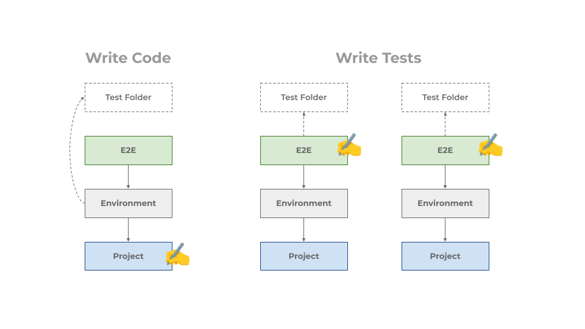

# Benefits in depth

Game changing **scalable** and **maintainable** setup for Verdaccio. 

> [!NOTE]
> 💡 Learn more about the common problems with shared environments in the **💡[docs/motivation.md](./docs/motivation.md)💡**.

#### Project Graph

Here the project graph of the research.


## 🛡️ Environment Folders to Isolate Files During E2E Tests

All files that change during testing are contained within an isolated folder, ensuring they don't interfere with your local setup or other tests.

By isolating the environment for each E2E project, you avoid conflicts with the local file system and package manager configurations, enabling parallel test execution without issues like publish, install or file conflicts.

```sh
Root/
├── dist/
│   └── projects/
│       └── <project-name>/...
├── tmp/
│    └── environments/
│        └── <project-name>/
│            ├── storage/... # npm publish/unpublish
│            │   └── <org>
│            │       └── <package-name>/...
│            ├── node_modules/ # npm install/uninstall
│            │   └── <org>
│            │        └── <package-name>/...
│            ├── __test__/...
│            │   └── <test-file-name>/...
│            │        └── <it-block-env-setup>/...
│            │             └── test.file.ts
│            ├── .npmrc # local npm config configured for project specific Verdaccio registry
│            ├── package-lock.json # skipped creation by default
│            └── package.json # npm install/uninstall
└── projects/
    └── <project-name>/...
```

## 🚀 Scalability - A Parallel-Friendly Setup

This solution allows for **parallel execution** of tests, which was not possible before due to conflicts with file systems and package managers.

- ⏱️ No more waiting for tests to run sequentially. With isolated environments, each E2E test can run independently without interfering with others.
- ⏱️ Environment setup and test setup are separated, which means **significantly faster execution** of the tests and less overhead in CPU and general runtime.

## ⚡ Task Performance - Optimized Execution

To further improve task performance, we can now treat the E2E environment as **build output**.
No need for a running server anymore.

This allows us to **cache** the environment and **reuse** it across tests, leading to faster performance:

- 🔥 As it is decoupled from the running server we can now save cache the target
- 🔥 No need to stop and restart the server between tests, saving CPU and memory
- 🔥 No need to uninstall packages or delete storage folders manually. We can simply delete the isolated folder when needed.
- 🔥 The system only installs the necessary packages, further reducing time and resource usage.



### Changes in source

```mermaid
flowchart TB
P[project-e2e:e2e]:::e2e-.implicit.->S[project-e2e:env-setup]:::build;
S-.implicit.->E[project:build]:::build;
classDef e2e stroke:#f00
classDef env-setup stroke:#f00
classDef build stroke:#f00
```

### Changes in the test environments

```mermaid
flowchart TB
P[project-e2e:e2e]:::e2e-.implicit.->S[project-e2e:env-setup]:::env-setup;
S-.implicit.->E[project:build]:::build;
classDef e2e stroke:#f00
classDef env-setup stroke:#f00
```

### Changes in tests

```mermaid
flowchart TB
P[project-e2e:e2e]:::e2e-.implicit.->S[project-e2e:env-setup]:::build;
S-.implicit.->E[project:build]:::build;
classDef e2e stroke:#f00
```

## ✨ Simplified Developer Experience (DX)

The **NX task graph** makes it easier to discover and understand the setup. Instead of relying on complex global setup scripts:

- 🤌 No need for global setup files teardown or setup at all. The only connection to the tests files is just another target that runs before the E2E tests.
- 🤌 The process is faster because the test environment doesn’t require ongoing CPU or memory once set up.
- 🤌 Errors are easier to debug. Every step is on its own debugable.

## 🔧 Maintainability - Easy to Update and Manage

This approach makes the E2E setup more **maintainable** and easier to serve edge cases:

- A fine-grained task graph makes it easy to understand the project
- Since the environment doesn’t require a constantly running server, maintaining the setup becomes much simpler. The environment can be cached as a build output, reducing complexity.
- as the cleanup logic of a test is just deleting the files this debug effort is gone completely
- The NX task graph provides a clear visual overview of the process, making it easy to see what runs when and how the environment is set up.
- Configuring a test setup is in a single place and provides fine-grained configuration


In summary, this new setup offers a more scalable, maintainable, and performant way to handle E2E testing.
By isolating environments and using NX’s powerful tools, it becomes easier to run, manage, and debug E2E tests across projects.

